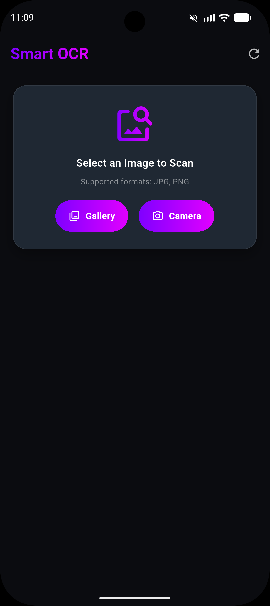
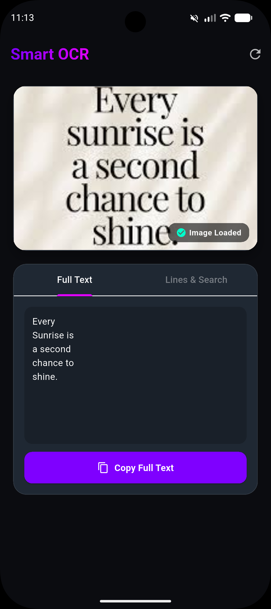
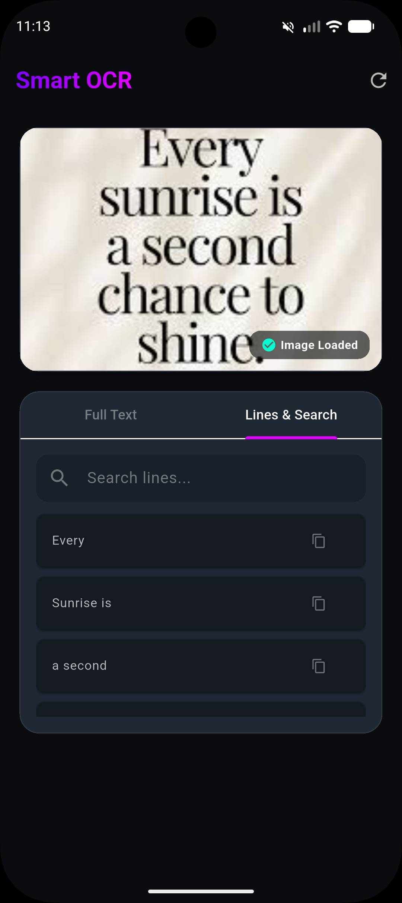

# 🚀 Smart OCR — Flutter Text Recognition App

Smart OCR is a premium, high-performance Flutter mobile application that extracts text from camera snapshots or gallery images using **Google ML Kit Text Recognition**. 

This project is built following strict **Clean Architecture (Feature-First)** patterns, using **flutter_bloc** for state management, **go_router** for navigation, and **get_it** for dependency injection.

---

## ✨ Features

- 📸 **Multi-Source Image Picking**: Select images directly from your photo library or capture a new one using the device camera.
- 🔍 **On-Device Text Recognition**: Powered by Google ML Kit, extracting text offline with low latency and high accuracy.
- 🎨 **Premium UI/UX Design**: Elegant dark-themed user interface (`#0B0C10` background, `#1F2833` surfaces) featuring modern typography, cards with subtle borders, and glowing violet/neon-magenta button gradients.
- 📑 **Dual-Tab Interface**:
  - **Full Text**: Copy the entire text blocks with one click.
  - **Lines & Search**: Dynamic list view of text lines. Filter lines instantly using the real-time search field and copy individual lines.
- 🛡️ **Exception Shielding**: Secure exception handling in the data layer translating system issues to clean failures in the domain.

---

## 📱 Screenshots

<p align="center">
  
  
  
</p>

---

## 🛠️ Technology Stack

| Concern | Technology |
| --- | --- |
| **Architecture** | Clean Architecture (Feature-First) |
| **State Management** | BLoC (`flutter_bloc`) |
| **Navigation** | `go_router` |
| **Networking** | `dio` (with Auth, Retry, and logging Interceptors) |
| **Dependency Injection** | `get_it` |
| **Text Recognition** | `google_mlkit_text_recognition` |
| **Equality Comparison** | `equatable` |
| **JSON Serialization** | `json_serializable` |
| **Testing** | `bloc_test` + `mocktail` |

---

## 🏛️ Architecture Overview

The codebase is strictly separated into modular layers, establishing a **Presentation ➔ Domain ➔ Data** dependency flow:

```
lib/
 ├─ core/                     # Shared utilities & global configurations
 │   ├─ config/               # Navigation & route settings (GoRouter)
 │   ├─ errors/               # Core exceptions and failures
 │   └─ network/              # Centralized single Dio client & interceptors
 │
 ├─ features/                 # Modular feature-first folders
 │   └─ text_recognition/
 │        ├─ domain/          # Pure business logic (Entities, Repository interfaces, UseCases)
 │        ├─ data/            # Infrastructure implementations (Models, Local DataSources)
 │        └─ presentation/    # Visual layer & state machines (BLoC, Pages, Widgets)
 │
 ├─ injection_container.dart  # Global Service Locator setup (GetIt)
 └─ main.dart                 # App initialization & configuration
```

- **Domain Layer**: Contains Dart-only constructs. No Flutter imports. Implements the `TextResult` entity, `TextRecognitionRepository` interface, and the executable `RecognizeTextUseCase`.
- **Data Layer**: Concrete implementations. Uses Google ML Kit to parse text, models extending domain entities with automatic `fromJson`/`toJson` serializations, and repository implementations catching native exceptions to return domain failures.
- **Presentation Layer**: Implements `TextRecognitionBloc` with state transitions. Re-renders UI using modern Dart 3 switch expressions.

---

## 🚀 Getting Started

### Prerequisites
Make sure you have [Flutter SDK](https://docs.flutter.dev/get-started/install) installed on your system.

### Installation
1. Clone the repository and navigate into the project directory:
   ```bash
   cd googlemlkit
   ```

2. Fetch all required dependencies:
   ```bash
   flutter pub get
   ```

3. Run the code generator to build serialization files (`text_result_model.g.dart`):
   ```bash
   dart run build_runner build --delete-conflicting-outputs
   ```

### Running the App
Run the app locally on a simulator or physical test device:
```bash
flutter run
```

---

## 🧪 Verification and Testing

The project contains unit and BLoC tests to verify routing configurations, entity models, and state emissions under mock conditions:

To execute all tests, run:
```bash
flutter test
```
To run static code analysis and ensure strict type-safety and format conformity:
```bash
flutter analyze
```
